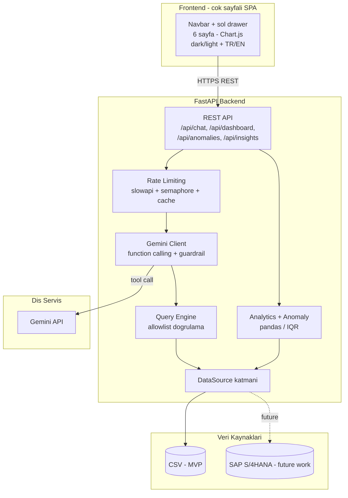
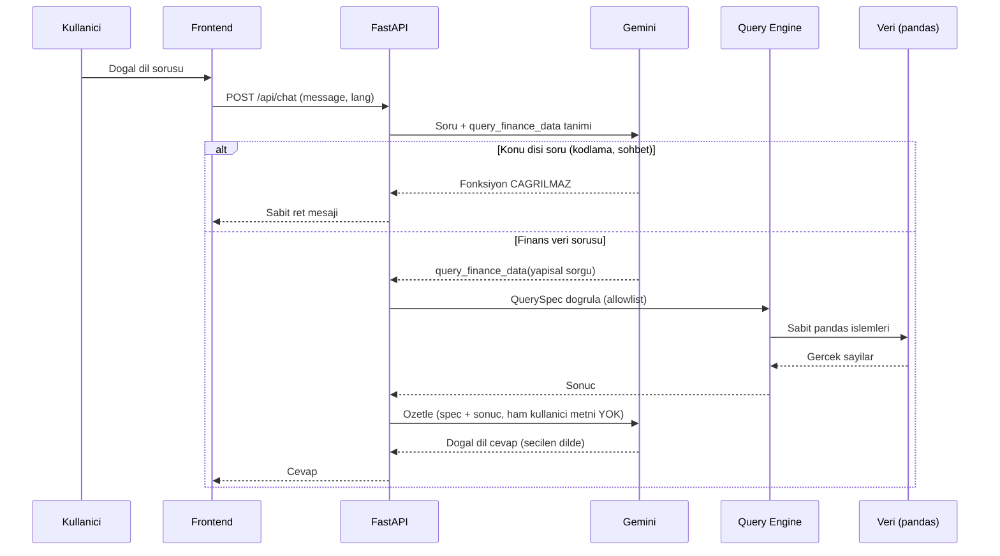
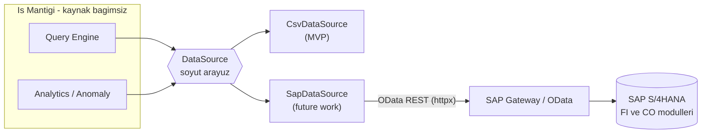

# ERPilot AI - Mimari ve SAP Entegrasyonu

## 1. Sistem Mimarisi

Katmanlar:

- **Frontend** — navbar + soldan acilan drawer ile gezilen 6 sayfali tek
  sayfa uygulamasi (Genel Bakis, Trend, Butce, Kategori, Anomali, Veriye Sor).
  Hash tabanli yonlendirme, Chart.js grafikler, dark/light tema ve TR/EN dil
  destegi. Backend ile yalnizca REST uzerinden konusur.
- **REST API** — kaynak odakli endpoint'ler; Pydantic ile girdi/cikti
  dogrulamasi. Dashboard/anomali/insight endpoint'leri opsiyonel `?ay=` alir.
- **Rate Limiting** — IP basina limit, Gemini'ye es zamanli istek sinirlamasi,
  TTL cache, tek httpx istemcisi.
- **Gemini Client** — function calling akisi ve dashboard AI yorumlari; konu
  disi sorulari mimari duzeyde reddeder.
- **Query Engine** — AI'in urettigi yapisal sorguyu allowlist'e karsi dogrular
  ve sabit pandas islemleriyle calistirir.
- **Analytics / Anomaly** — dashboard agregasyonlari (ay filtreli),
  deterministik yorum tabani ve IQR tabanli anomali tespiti.
- **DataSource** — veri kaynagini soyutlar; is mantigi CSV mi SAP mi bilmez.

## 2. "Veriye Sor" Akisi (function calling + guvenlik)

Onemli guvenlik noktalari:

- AI **ham SQL/kod uretmez**; yalnizca `QuerySpec` semasina uygun yapisal nesne uretir.
- `QuerySpec` Pydantic `Literal` tipleri = **allowlist**; kolon, operator ve metrik degerleri sabittir.
- Calistirma `eval`/`exec` veya string SQL olmadan, yalnizca sabit pandas fonksiyonlariyla yapilir.
- AI fonksiyon cagirmazsa serbest metni kullaniciya **gosterilmez**; panel yalnizca veriye dayali cevap veya ret uretir.
- **Ozetleme cagrisina kullanicinin ham metni verilmez**; yalnizca dogrulanmis `QuerySpec` ve sorgu sonucu gonderilir. Boylece mesru bir veri sorusuna bindirilmis konu disi istek (piggyback prompt injection) cevaba sizamaz.

## 3. SAP Entegrasyonu (Future Work)

MVP demo verisini CSV'den okur. Gercek senaryoda veri SAP S/4HANA'dan gelir.
Anahtar tasarim: **is mantigi degismez** - yalnizca `DataSource` implementasyonu degisir.

### Entegrasyon yontemi

`SapDataSource`, SAP S/4HANA'nin **OData REST servislerine** `httpx` ile baglanir:

1. SAP OData endpoint'ine kimlik dogrulamali GET istegi (OAuth2 / Basic).
2. Donen JSON `results` listesi pandas DataFrame'e cevrilir.
3. SAP alan adlari normalize semaya eslenir.
4. Sonuc `TRANSACTION_COLUMNS` / `BUDGET_COLUMNS` semasinda dondurulur.

### Ornek alan eslemesi

| SAP alani | ERPilot normalize alani |
|---|---|
| CompanyCode / CostCenter | departman |
| GLAccountGroup | kategori |
| FiscalPeriod | ay / ay_no |
| AmountInCompanyCodeCrcy | tutar |
| DebitCreditCode (S/H) | tur (gider / gelir) |
| PostingDate | tarih |

Alternatif: `pyrfc` ile dogrudan BAPI/RFC cagrisi (SAP NW RFC SDK gerektirir).

### Gecis

`.env` icinde `DATA_SOURCE=csv` -> `DATA_SOURCE=sap` degisikligi yeterlidir.
`query_engine`, `analytics`, `anomaly` ve frontend katmanlarinda **hicbir degisiklik gerekmez**.

## 4. Dil Destegi ve Insight Cache (Optimizasyon)

Arayuz TR/EN destekler. AI uretilen metinleri her dil degisiminde yeniden
uretmek maliyetli olacagi icin su yaklasim kullanilir:

- **Insight'lar** statik veriden uretilir; bir ayin yorumu hic degismez.
  Bu yuzden Gemini **tek cagrida hem TR hem EN** uretir ve sonuc **kalici
  cache**'lenir (TTL yok). Dil degisince yeni API cagrisi yapilmaz - cache'ten
  gelir. Maliyet: ay basina 1 cagri, omur boyu (~13 cagri toplam).
- **Chat** cevaplari tek seferliktir; istek ile gelen `lang` parametresine
  gore Gemini zaten yaptigi tek cagrida secilen dilde yanitlar - ek maliyet yok.
- **Fallback** (API key yoksa) deterministik metinler hem TR hem EN kodda
  hazirdir - sifir maliyet.

> Not: Tema (dark/light) ve dil secimi `localStorage`'da saklanir; SPA oldugu
> icin sayfa gecislerinde korunur, tam yenilemede de kalici kalir.
